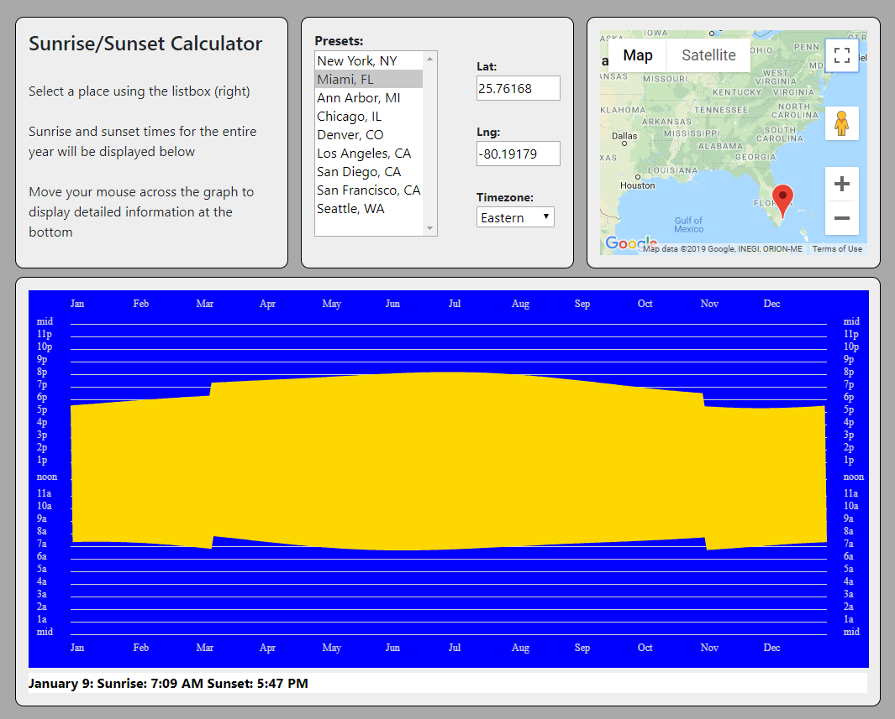

# React Suntimes
This project is a demonstration of using React and TypeScript to display the sunrise and sunset times
for a variety of different locations in the U.S.

## How to Use
Simply select a location from the listbox at the top of the screen.  This will cause the latitude, longitude, 
and time zone values displayed immediately to the right to be updated.  Additionally, it creates a 
graphic display that shows sunrise and sunset times throughout the year to be displayed.  The chart can be read
as having January 1 on the left edge, December 31 on the right edge, with the sunrise and sunset times for each
day displayed as a yellow/gold column.  

Here's a screenshot:

## Author
* **Greg Sommerville** - *Initial work* 
 
## License
This project is licensed under the Apache 2.0 License - see the [LICENSE.md](LICENSE.md) file for details